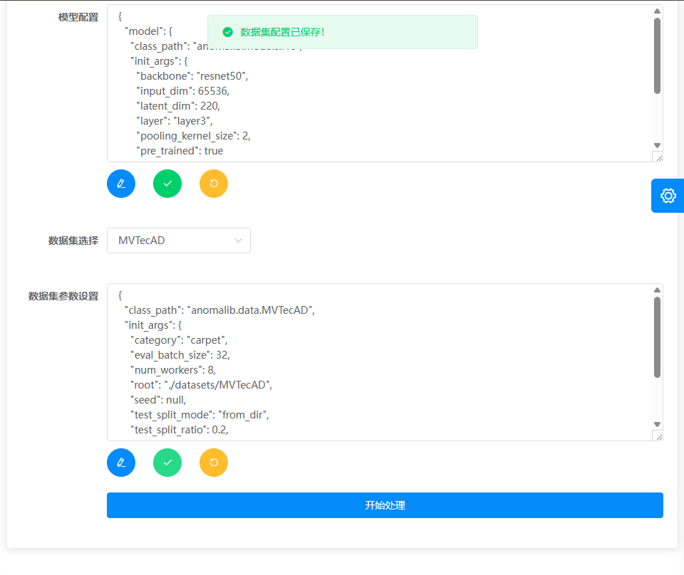
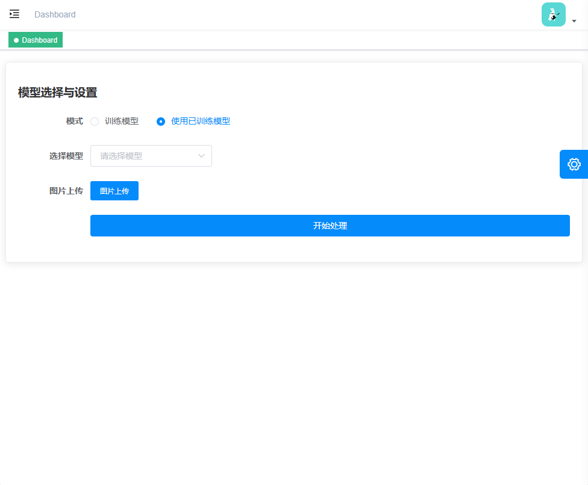
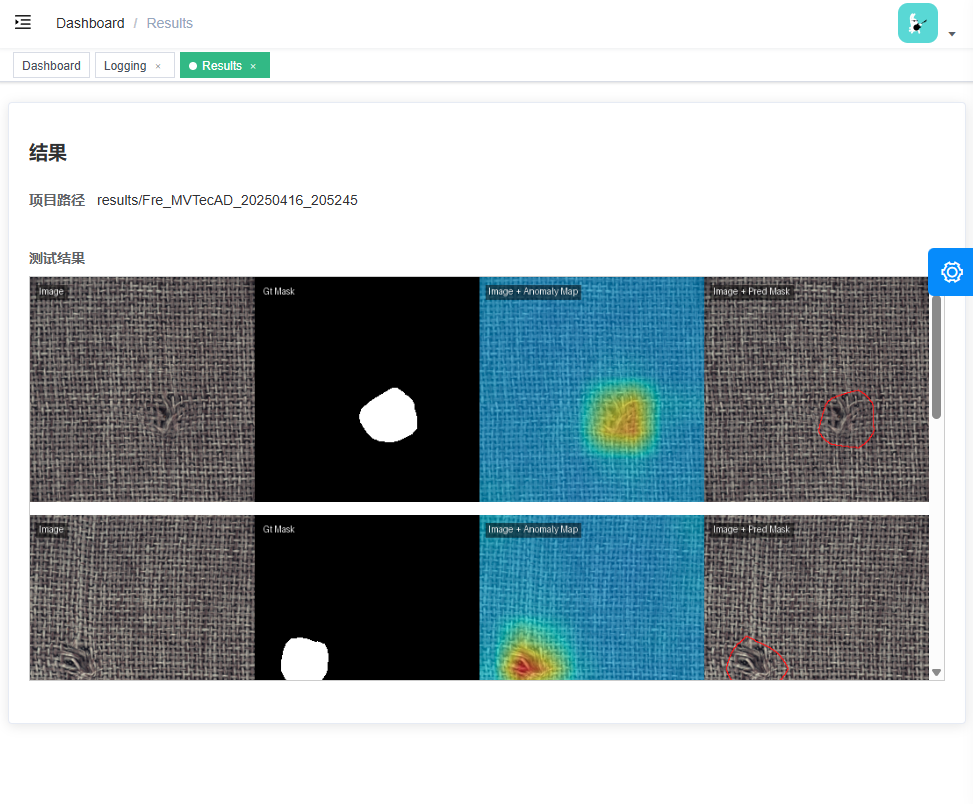
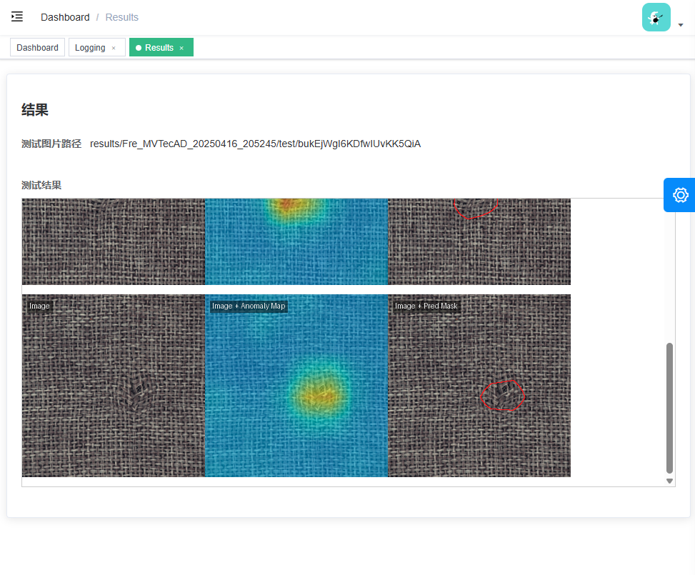

<!-- <p align="center" style="display: flex; justify-content: center; gap: 20px;">
  
  
</p> -->
<p align="center" style="display: flex; display: flex; align-items: center;">
  
  
</p>


<p align="center">
  <a href="https://github.com/vuejs/vue">
    
  </a>
  <a href="https://github.com/ElemeFE/element">
    
  </a>
  <a href="https://github.com/PanJiaChen/vue-element-admin/blob/master/LICENSE">
    
  </a>
</p>

English | [简体中文](./README.zh-CN.md) | [日本語](./README.ja.md) | [Spanish](./README.es.md)

<!-- <p align="center">
  <b>SPONSORED BY</b>
</p>
<table align="center" cellspacing="0" cellpadding="0">
  <tbody>
    <tr>
      <td align="center" valign="middle">
       <a href="" title="" target="_blank" style="padding-right: 20px;">
        
        </a>
      </td>
    </tr>
  </tbody> 
</table>-->

## Introduction

TextileAD-UI is an intuitive tool for training and inference in anomaly detection, designed to help users train and evaluate models without the need for coding. It leverages the [anomalib](https://github.com/open-edge-platform/anomalib) backend for anomaly detection processing and uses [vue-element-admin](https://github.com/PanJiaChen/vue-element-admin) for the frontend user interface.

## Getting started

### System requirements

`Python==3.10`

`npm==6.14.10`

`vue==2.6.10`

#### Browsers support

Modern browsers and Internet Explorer 10+.

| [](https://godban.github.io/browsers-support-badges/)</br>IE / Edge | [](https://godban.github.io/browsers-support-badges/)</br>Firefox | [](https://godban.github.io/browsers-support-badges/)</br>Chrome | [](https://godban.github.io/browsers-support-badges/)</br>Safari |
| --------- | --------- | --------- | --------- |
| IE10, IE11, Edge | last 2 versions | last 2 versions | last 2 versions |

### Frontend

```bash
# clone the project
git clone https://github.com/BlueberryOreo/TextileAD-UI.git

# enter the project directory
cd TextileAD-UI

# install dependency
npm install

# develop
npm run dev
```

This will automatically open http://localhost:9527

### Server

```bash
# install dependency
pip install -r requirements.txt

# enter the core directory
cd core

# run
python app.py

# develop
python app.py --debug
```

This will automatically run on http://localhost:5000

## Build

```bash
# build for test environment
npm run build:stage

# build for production environment
npm run build:prod
```

## Advanced

```bash
# preview the release environment effect
npm run preview

# preview the release environment effect + static resource analysis
npm run preview -- --report

# code format check
npm run lint

# code format check and auto fix
npm run lint -- --fix
```

Refer to [Documentation](https://panjiachen.github.io/vue-element-admin-site/guide/essentials/deploy.html) for more information about vue-element-admin

## Snapshots

### Train settings




### Test settings




### Training progress


### Results

After training



After testing



## Acknowledgements

This project is built on [anomalib](https://github.com/open-edge-platform/anomalib) and [vue-element-admin](https://github.com/PanJiaChen/vue-element-admin). The authors thank everyone who makes their code available. 
