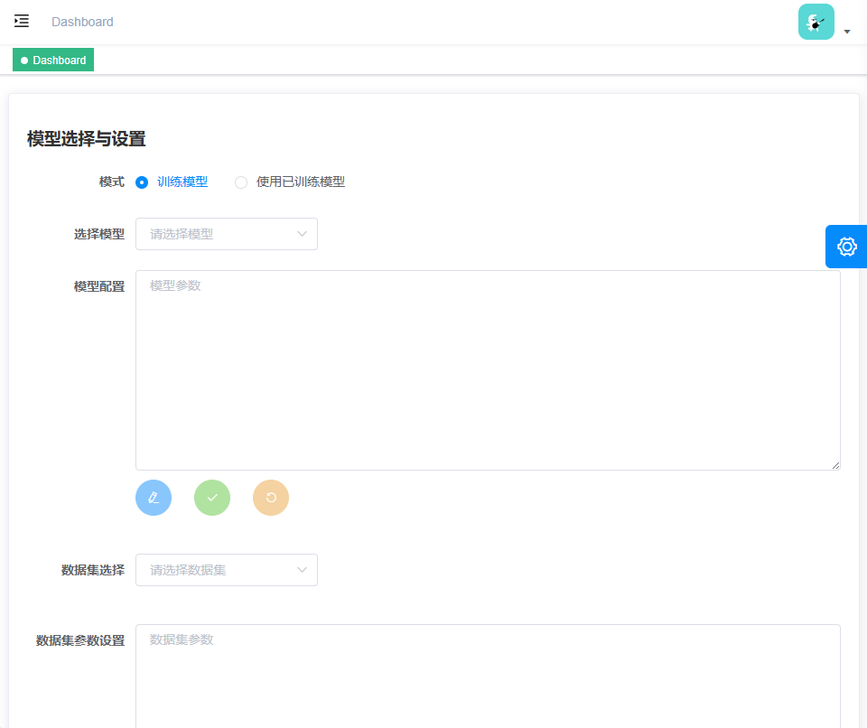
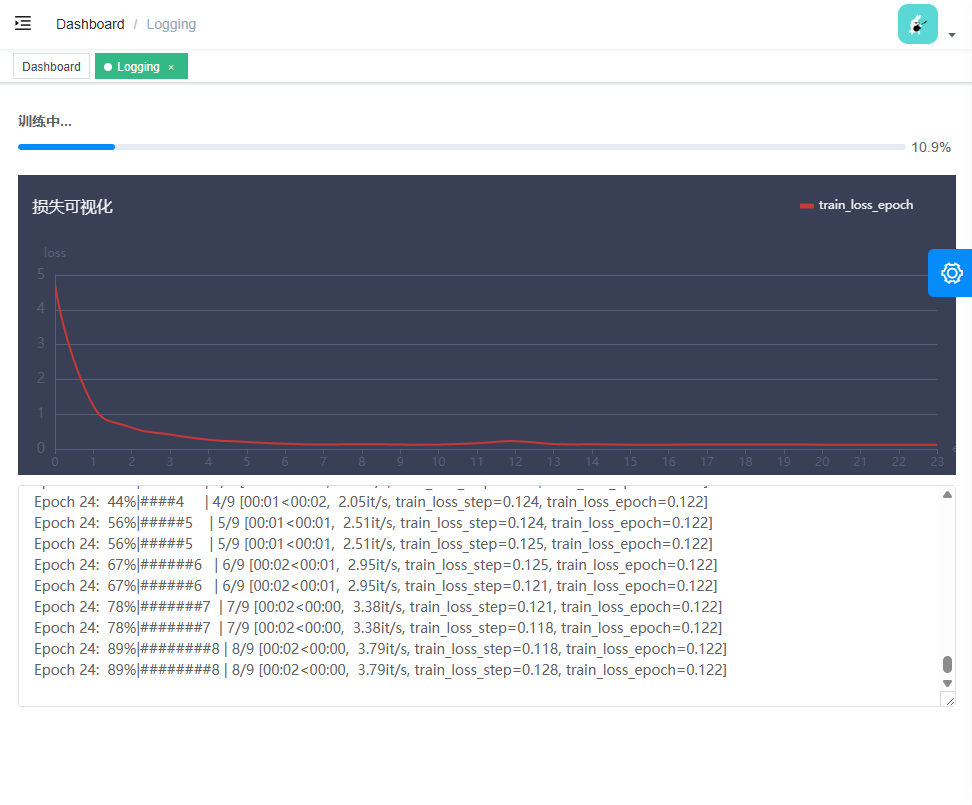

<!-- <p align="center" style="display: flex; justify-content: center; gap: 20px;">
  
  
</p> -->
<p align="center" style="display: flex; align-items: center;">
  
  
</p>


<p align="center">
  <a href="https://github.com/vuejs/vue">
    
  </a>
  <a href="https://github.com/ElemeFE/element">
    
  </a>
  <a href="https://github.com/PanJiaChen/vue-element-admin/blob/master/LICENSE">
    
  </a>
</p>

简体中文 | [English](./README.md)

<!-- <p align="center">
  <b>SPONSORED BY</b>
</p>
<table align="center" cellspacing="0" cellpadding="0">
  <tbody>
    <tr>
      <td align="center" valign="middle">
       <a href="" title="" target="_blank" style="padding-right: 20px;">
        
        </a>
      </td>
    </tr>
  </tbody> 
</table>-->

## 简介

TextileAD-UI是一个简单易用的异常检测工具，能够帮助用户在无代码的情况下训练和测试异常检测模型。TextileAD-UI使用[anomalib](https://github.com/open-edge-platform/anomalib)进行后端异常检测，使用[vue-element-admin](https://github.com/PanJiaChen/vue-element-admin)作为前端用户交互界面。

## 开始使用

### 运行环境需求

`Python==3.10`

`npm==6.14.10`

`vue==2.6.10`

#### 浏览器支持

现代浏览器和Internet Explorer 10+。

| [](https://godban.github.io/browsers-support-badges/)</br>IE / Edge | [](https://godban.github.io/browsers-support-badges/)</br>Firefox | [](https://godban.github.io/browsers-support-badges/)</br>Chrome | [](https://godban.github.io/browsers-support-badges/)</br>Safari |
| --------- | --------- | --------- | --------- |
| IE10, IE11, Edge | last 2 versions | last 2 versions | last 2 versions |

### 启动后端

```bash
# install dependency
pip install -r requirements.txt

# enter the core directory
cd core

# run
python app.py

# develop
python app.py --debug
```

后端会在http://localhost:5000上运行。

### 启动前端

```bash
# clone the project
git clone https://github.com/BlueberryOreo/TextileAD-UI.git

# enter the project directory
cd TextileAD-UI

# install dependency
npm install

# develop
npm run dev
```

前端会在http://localhost:9527上运行。可以打开浏览器进行访问。

## 构建前端

```bash
# build for test environment
npm run build:stage

# build for production environment
npm run build:prod
```

## 高级

```bash
# preview the release environment effect
npm run preview

# preview the release environment effect + static resource analysis
npm run preview -- --report

# code format check
npm run lint

# code format check and auto fix
npm run lint -- --fix
```

参考[Documentation](https://panjiachen.github.io/vue-element-admin-site/guide/essentials/deploy.html)以获取更多关于vue-element-admin的信息。

## 运行截图

### 训练设置




### 测试设置


### 训练过程



### 结果展示

训练后结果


测试后结果


## 致谢

本项目基于[anomalib](https://github.com/open-edge-platform/anomalib)和[vue-element-admin](https://github.com/PanJiaChen/vue-element-admin)构建。我们感谢所有将这些项目开源的作者。
